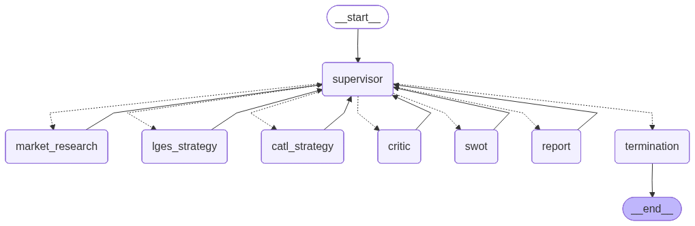

# 글로벌 배터리 시장 전략 비교 분석 Agent

## Overview

- **Objective** : 전기차 캐즘 심화 환경에서 LG에너지솔루션(LGES)과 CATL의 포트폴리오 다각화 전략을 비교 분석하여, 투자자·전략기획 담당자가 기업 간 우위 요소를 판단하고 포트폴리오 의사결정에 활용할 수 있는 구조화된 인사이트를 제공한다.
- **Method** : LangGraph Supervisor 패턴 기반 Multi-Agent 시스템 + Agentic RAG + 확증 편향 방지 2단계 전략
- **Tools** : TavilySearch (웹 검색), FAISS (벡터 검색), BAAI/bge-m3 (임베딩)

## Features

- **PDF 자료 기반 정보 추출** : IEA 글로벌 EV 전망, LGES/CATL 사업보고서, ESS 배터리 보고서 (총 ~100p) RAG 검색
- **Agentic RAG** : 각 Agent가 RAG 검색 결과를 자체 평가하여 기준 미달 시 쿼리 재작성 후 재검색
- **확증 편향 방지 전략** :
  - **1단계 (쿼리 수준)** : LGES/CATL Strategy Agent가 긍정·부정 양방향 쿼리를 프롬프트에 명시적으로 포함
  - **2단계 (Agent 수준)** : Critic Agent가 T2/T3 결과를 독립적으로 검토, 각 기업 부정 근거 ≥ 2건 강제 확보
- **품질 관리** : Supervisor가 중앙에서 각 Task 결과의 계량 조건·내용 품질 일괄 검토, 미통과 시 재실행 지시 (Task당 최대 2회)
- **비용 제어** : LLM 호출 ≤ 20회 제한, 초과 시 완성된 Task까지 보고서 생성 후 종료
- **근거 없음 처리** : RAG + 웹 검색 모두 실패 시 임의 생성 금지, "근거 불충분" 명시

## Tech Stack

| Category | Details |
|----------|---------|
| Framework | LangGraph, LangChain, Python |
| LLM | GPT-4o-mini via OpenAI API |
| Retrieval | FAISS |
| Embedding | BAAI/bge-m3 (multilingual, Dense+Sparse) |
| Web Search | Tavily Search API |
| Document Loader | PDFPlumber |

## Agents

| # | Agent | 역할 | 패턴 | 도구 |
|---|-------|------|------|------|
| 0 | **Supervisor** | 작업 분배·품질 판단·재시도·종료 결정 | — | — |
| 1 | **Market Research Agent** (T1) | EV 캐즘·HEV·ESS·배터리 기술 경쟁 지형 분석 | Sequential | RAG + Web |
| 2 | **LGES Strategy Agent** (T2) | LGES 포트폴리오·지역·기술 전략 분석 | Parallel (T3과 동시) | RAG + Web |
| 3 | **CATL Strategy Agent** (T3) | CATL 포트폴리오·지역·기술 전략 분석 | Parallel (T2와 동시) | RAG + Web |
| 4 | **Critic Agent** (T4) | T2/T3 결과에 반론 제기, 각 기업 부정 근거 ≥ 2건 확보 | Negotiation | RAG + Web |
| 5 | **Comparison & SWOT Agent** (T5) | 전략 비교표 + SWOT 4분면 작성 | Sequential | — |
| 6 | **Report Writing Agent** (T6) | 7개 섹션 완성 보고서 생성 | Sequential | — |

## Architecture



## Directory Structure

```
battery-agent/
├── data/                    # RAG용 PDF 문서
│   ├── IEA_GlobalEVOutlook2025_summary.pdf    (20p)
│   ├── LGES_annual_report.pdf                 (25p)
│   ├── CATL_annual_report.pdf                 (25p)
│   └── ESS_battery_report.pdf                 (25p)
├── rag/
│   ├── retriever.py         # bge-m3 + FAISS 기반 MultiPDF RAG
│   └── utils.py             # format_docs, format_searched_docs
├── tools/
│   ├── rag_tools.py         # Agent별 @tool RAG 검색 래퍼
│   └── web_search.py        # TavilySearch + 양방향 쿼리
├── prompts/
│   └── prompts.py           # 모든 Agent 프롬프트 템플릿
├── agents/
│   ├── market_research.py   # T1: 시장 환경 분석
│   ├── lges_strategy.py     # T2: LGES 전략 분석
│   ├── catl_strategy.py     # T3: CATL 전략 분석
│   ├── critic.py            # T4: 반론·리스크 탐색
│   ├── swot.py              # T5: 비교·SWOT 구조화
│   └── report.py            # T6: 보고서 생성
├── graph/
│   ├── state.py             # WorkflowState, AgentOutput TypedDict
│   └── graph.py             # LangGraph Supervisor 패턴 그래프
├── outputs/                 # 생성된 보고서 (.md, .pdf)
├── app.py                   # 실행 스크립트
├── .env.example             # 환경변수 템플릿
└── README.md
```

## Contributors 
- 배민 : Agent Design
- 이성민 : Prompt Engineering, PDF Parsing